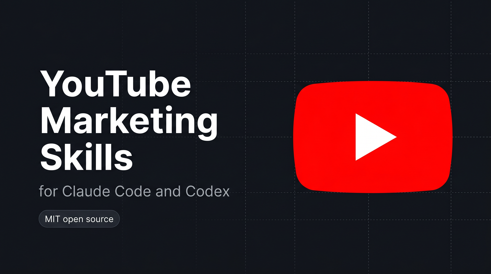

<p align="center">
  
</p>

# YouTube Marketing Skills for Claude Code and Codex

<p align="center">
  
  
  
  
  
  
  
</p>

6 skills that help Claude Code and Codex grow a YouTube channel: high-CTR titles, SEO descriptions with chapters, retention hook scripts for long-form and YouTube Shorts, designer-ready thumbnail briefs, community-tab posts, and weekly upload plans. You supply the video; the skills write the packaging and, on approval, upload and schedule it. No coding required.

## Install

Pick whichever way you use Claude Code or Codex:

### Codex CLI

```bash
codex plugin marketplace add sergebulaev/youtube-skills
codex plugin add youtube-skills@youtube-skills
```

To test a local clone before publishing changes:

```bash
git clone https://github.com/sergebulaev/youtube-skills.git
cd youtube-skills
codex plugin marketplace add .
codex plugin add youtube-skills@youtube-skills
```

### claude.ai (web)

1. Open https://claude.ai/code
2. Go to **Skills** in the sidebar
3. Click **Add from GitHub**
4. Paste: `sergebulaev/youtube-skills`
5. Done. The skills activate automatically when you ask about YouTube or Shorts.

### Claude Desktop (Mac / Windows)

1. Open Claude Desktop
2. Open **Settings** (gear icon)
3. Go to **Skills**
4. Click **Add from GitHub**
5. Paste: `sergebulaev/youtube-skills`
6. Done. Start a new conversation and ask Claude to title your next video.

### Claude Code (CLI / VS Code / JetBrains)

```
/plugin marketplace add sergebulaev/youtube-skills
/plugin install youtube-skills@youtube-skills
```

Or clone the repo and open it as your working directory:

```bash
git clone https://github.com/sergebulaev/youtube-skills.git
cd youtube-skills
```

## What you can do

Once installed, just ask Claude Code or Codex for help with YouTube. The right skill activates automatically.

**Title a video:**
> "Give me 5 high-CTR titles for a video on cutting my render time in half."

**Write the description:**
> "Write the description with chapters and keywords for this video: [paste the outline]"

**Script the opening:**
> "Script the first 30 seconds so people don't click away. The title is 'How I shipped in 5 days'."

**Hook a Short:**
> "Write the first 3 seconds for a Short about one editing setting that doubles views."

**Brief a thumbnail:**
> "Give me 3 thumbnail concepts a designer can build for this video."

**Plan your week:**
> "Plan a week of YouTube content. I'm building an AI app in public and can do 1 long-form plus 3 Shorts."

Every skill shows you a draft first and waits for your OK. Nothing gets published without your approval.

## The 6 skills

| Skill | What it does |
|---|---|
| **Title Optimizer** | Writes high-CTR titles under 100 chars using 2026 formulas (curiosity, number, how-I, mistake, transformation, versus). Front-loads the words that decide the click and returns 3 to 5 A/B variants tagged by goal |
| **Description Writer** | Writes the full description under 5,000 chars: a first-150-char hook (the only part visible before "Show more"), timestamped chapters, natural keywords, links, and a real CTA |
| **Hook Scripter** | Scripts the spoken opening that decides retention: the first 30 seconds of a long-form video, or the first 3 seconds of a Short, with no intro and a designed loop |
| **Thumbnail Brief** | Turns a video into a designer-ready brief (focal subject, face/emotion, 4-word text overlay, contrast, composition) plus 2 to 3 A/B concepts and the upload flow |
| **Community Post Writer** | Writes community-tab text posts, polls, and questions that keep the channel warm between uploads. Returns a copy-paste block (community posts have no API) |
| **Content Planner** | Builds a weekly plan: long-form vs Shorts mix, cadence, per-slot title and thumbnail pairing, hook angle, community posts, and a CTR / retention / subscribe goal balance |

## How publishing works on YouTube

YouTube is a **video-only platform**: every published post needs a single video, which you supply. The skills write the title, description, hook script, and thumbnail brief; you bring the .mp4. Uploading to YouTube on the native Data API means a Google OAuth flow, the resumable-upload protocol, and quota tracking.

This bundle hands that chain to [Publora](https://publora.com). On approval, it creates a draft, uploads your video to S3, sets the title and metadata, and schedules the post, all over a few REST calls. A custom thumbnail can be attached too, but the thumbnail image upload is out of band (Publora dashboard or a dedicated endpoint); the bundle automates the attach step, not the image upload. The writer skills use this on approval.

## Optional: auto-upload with Publora

By default, the skills draft everything for you to paste into YouTube Studio. If you want Claude Code or Codex to upload and schedule the video you supply, connect Publora. It takes about 2 minutes.

### What is Publora?

[Publora](https://publora.com) is a publishing API that turns one flow (`create-post`, `get-upload-url`, `update-post`) into a scheduled YouTube upload, and can cross-post the same content to other platforms.

### Setup (2 minutes)

**Step 1.** Sign up at https://app.publora.com/signup (free)

**Step 2.** Connect YouTube: click **Channels** in the left sidebar, then **Add Channel**, pick **YouTube**, authorize with Google.

**Step 3.** Find your Platform ID: go to **Channels**, click your YouTube channel. The ID looks like `youtube-UCxxxxxxxxxxxxxxxxxxxxxx`. Copy the whole thing including `youtube-`.

**Step 4.** Get your API key: click **Settings** (gear icon, bottom-left), then **API**, then **Create Key**. Copy the `sk_...` string.

**Step 5.** Create a file called `.env` in the youtube-skills folder:

```
PUBLORA_API_KEY=sk_paste_your_key_here
YOUTUBE_PLATFORM_ID=youtube-paste_your_channel_id_here
```

If you cloned the repo, copy the template instead:

```bash
cp .env.example .env
```

Then open `.env` and replace the placeholders with your real values.

**Step 6.** Install two small Python packages:

```bash
pip install requests python-dotenv
```

**Step 7.** Test it. Ask Claude Code or Codex:

> "Schedule a test video as unlisted via Publora 24 hours from now using [path to a short .mp4], title 'API connection test'."

If Publora returns a `postGroupId`, you're set. Cancel the post in the Publora dashboard before the scheduled time. If you get HTTP 401, your API key is wrong. If you get `Invalid platform ID format`, your `YOUTUBE_PLATFORM_ID` is wrong. See [Troubleshooting](#troubleshooting).

> **Note on community posts:** YouTube community-tab posts and polls have no publishing API, so the Community Post Writer always returns its draft as a copy-paste block for you to post yourself. Videos and Shorts auto-upload.

## Voice rules

Every skill follows these rules automatically:

1. No em dashes. Biggest AI tell in 2026.
2. Capitalize names. Always. Lowercase a brand reads as careless.
3. No AI vocabulary: "leverage", "fundamentally", "streamline", "harness", "delve", "unlock", "foster".
4. Specific numbers beat adjectives. "in 28 days" beats "fast".
5. The title is a promise, not a summary. Curiosity plus a concrete payoff.
6. Title and thumbnail are a pair. They never repeat the same words.
7. The first 30 seconds (or 3 on a Short) is the real algorithm. No intro.
8. Title caps at 100 chars (sweet spot 40 to 60). Description caps at 5,000, first 150 visible.

## Troubleshooting

| Problem | Fix |
|---|---|
| Skills don't activate when I ask about YouTube | Make sure you installed via the Skills panel, `/plugin install`, or `codex plugin add`. Try a new conversation. |
| "PUBLORA_API_KEY not set" | Your `.env` file is missing or in the wrong folder. It should be in the `youtube-skills/` root. |
| "401 Invalid API key" from Publora | Your API key is wrong or revoked. Go to Publora Settings > API > Create a new key. |
| "Invalid platform ID format" | Your `YOUTUBE_PLATFORM_ID` is wrong. Go to Publora Channels and copy the full `youtube-...` string. |
| My video failed with VIDEO_REQUIRED | YouTube needs a video on every post. Point the skill at your local .mp4; a text-only YouTube post cannot publish. |
| My custom thumbnail didn't apply | The channel must be verified, and the image must be JPEG/PNG under 2 MB. Applying is best-effort: the video still publishes without it. |
| My upload is over 512 MB | Publora caps uploads at 512 MB. Compress the video, or upload the large file via YouTube Studio. |
| `pip install` fails | Use a virtual environment: `python -m venv venv && source venv/bin/activate && pip install requests python-dotenv` |

## Cross-cutting references

- [`references/hook-formulas.md`](references/hook-formulas.md) - the 10 YouTube title and hook formulas with skeletons and goal tags
- [`references/algorithm-heuristics.md`](references/algorithm-heuristics.md) - 2026 YouTube ranking (CTR x retention), timing, and limits
- [`references/thumbnail-principles.md`](references/thumbnail-principles.md) - the thumbnail design language and the upload flow
- [`references/voice-rules.md`](references/voice-rules.md) - the canonical voice rules every skill inherits

---

<details>
<summary><b>For developers: runtime compatibility, URL parsing, and internals</b></summary>

## Runtime compatibility

```
youtube-skills/
  skills/             SKILL.md frontmatter; native to Claude Code and Codex, others read as markdown
  .codex-marketplace/ generated nested Codex package (run scripts/sync_codex_marketplace.py)
  lib/                pure Python, works in any agent runtime
  references/         pure markdown, works anywhere
  scripts/            pure Python CLI, works anywhere
```

| Runtime | Auto-discovers skills? | Setup |
|---|---|---|
| **Claude Code** (CLI, Desktop, Web, IDE) | Yes | Install via plugin or clone. Skills activate on matching prompts. |
| **Codex CLI** | Yes | `codex plugin marketplace add sergebulaev/youtube-skills` and `codex plugin add youtube-skills@youtube-skills`. |
| **Anthropic Managed Agents** (`/v1/agents`) | Yes | Pass skill files in the agent context. |
| **Cursor / Cline / Aider** | Manual | Read `SKILL.md` files as prompt context; import `lib/` as Python. |
| **LangChain / AutoGen** | No | Use `lib/` as a package; feed `references/` as prompt context. |

## Generic Python agent quickstart

```python
import sys; sys.path.insert(0, "path/to/youtube-skills")
from lib import parse_youtube_url, PubloraClient, publish

parsed = parse_youtube_url("https://www.youtube.com/watch?v=dQw4w9WgXcQ&t=10s")
print(parsed["video_id"], parsed["url_type"])  # dQw4w9WgXcQ video

# Write side (Publora) - the full media-required YouTube flow in one call
client = PubloraClient()  # reads PUBLORA_API_KEY from env
client.publish_video(
    content="Full description here.. first 150 chars are the hook.",
    platforms=["youtube-UCxxxxxxxxxxxxxxxxxxxxxx"],
    video_path="./episode-12.mp4",
    title="How I shipped in 5 days",
    privacy="public",
    scheduled_time="2026-07-01T16:00:00.000Z",
)

# Or the high-level wrapper that handles manual / Publora / diy routing
publish("video", draft_text="<description>", target_url="https://studio.youtube.com",
        video_path="./episode-12.mp4", title="How I shipped in 5 days",
        platforms=["youtube-UCxxxxxxxxxxxxxxxxxxxxxx"])
```

## URL handling

`lib/url_parser.py` parses YouTube video, Short, and channel URLs:

| URL fragment | Parsed |
|---|---|
| `youtube.com/watch?v=ID` | `{video_id, url_type: "video"}` |
| `youtu.be/ID` | `{video_id, url_type: "video"}` |
| `youtube.com/shorts/ID` | `{video_id, is_short: true, url_type: "short"}` |
| `youtube.com/@handle` | `{handle, url_type: "channel"}` |
| `youtube.com/channel/UC...` | `{channel_id, url_type: "channel"}` |

```bash
python lib/url_parser.py "https://www.youtube.com/shorts/abc123XYZ_-"
```

## The media-required upload flow

YouTube requires a video on every post, so a text-only post fails at publish with `VIDEO_REQUIRED`. The client runs the documented order:

1. `create-post` with no `scheduledTime` -> a draft, returns `postGroupId`
2. `get-upload-url` -> a pre-signed S3 URL
3. PUT the video to S3
4. `update-post/:postGroupId` -> set `scheduledTime` and any youtube settings

A custom thumbnail is *attached* in step 4 (it needs the `postGroupId`), never on `create-post`. `PubloraClient.publish_video()` runs all four steps; `set_thumbnail()` wraps the update-post attach call. Note the thumbnail *image upload* is out of band: Publora requires a tracked media asset from its dedicated YouTube thumbnail endpoint, which is not wired into this bundle. Upload the image in the Publora dashboard (or the dedicated endpoint once available) to get the `{mediaId, url}`, then attach. Without it, ship the video and set the thumbnail in YouTube Studio.

## Why community posts are copy-paste

YouTube community-tab posts and polls have no Publora endpoint and no public publishing API. `yt-community-post-writer` therefore drafts the post and returns it as a copy-paste block via `lib/backend_selector.py`. Videos and Shorts auto-upload normally.

</details>

## References

- [Publora API docs](https://docs.publora.com) - endpoint reference for the publishing layer
- [YouTube Creator Insider](https://www.youtube.com/@CreatorInsider) - YouTube's own signals on ranking and packaging

## License

MIT. Powered by [Publora](https://publora.com).

## Related open-source skill bundles

Part of a family of AI social-media marketing skill bundles for Claude Code and Codex:

- [linkedin-skills](https://github.com/sergebulaev/linkedin-skills) - LinkedIn
- [x-skills](https://github.com/sergebulaev/x-skills) - X (Twitter)
- [instagram-skills](https://github.com/sergebulaev/instagram-skills) - Instagram
- **youtube-skills - YouTube (this repo)**
- [threads-skills](https://github.com/sergebulaev/threads-skills) - Threads
- [tiktok-skills](https://github.com/sergebulaev/tiktok-skills) - TikTok
- [facebook-skills](https://github.com/sergebulaev/facebook-skills) - Facebook Pages

Also: [Anthropic Skills repo](https://github.com/anthropics/skills), the `awesome-claude-skills` directory.
